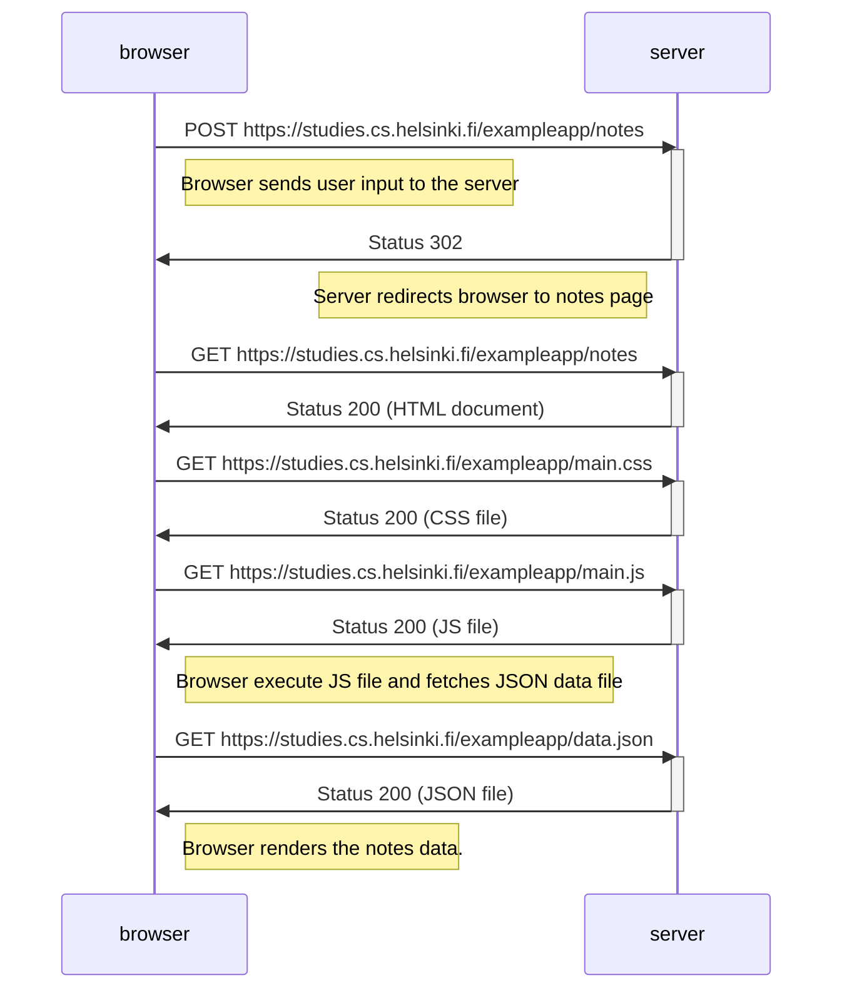

# Creating a New Note (TWA)

```mermaid
    sequenceDiagram
        participant browser
        participant server

        browser->>server: POST https://studies.cs.helsinki.fi/exampleapp/notes
        activate server
        Note right of browser: Browser sends user input to the server

        server->>browser: Status 302
        deactivate server
        Note left of server: Server redirects browser to notes page

        browser->>server: GET https://studies.cs.helsinki.fi/exampleapp/notes
        activate server
        server->>browser: Status 200 (HTML document)
        deactivate server

        browser->>server: GET https://studies.cs.helsinki.fi/exampleapp/main.css
        activate server
        server->>browser: Status 200 (CSS file)
        deactivate server

        browser->>server: GET https://studies.cs.helsinki.fi/exampleapp/main.js
        activate server
        server->>browser: Status 200 (JS file)
        deactivate server

        Note right of browser: Browser execute JS file and fetches JSON data file

        browser->>server: GET https://studies.cs.helsinki.fi/exampleapp/data.json
        activate server
        server->>browser: Status 200 (JSON file)
        deactivate server

        Note right of browser: Browser renders the notes data.
```