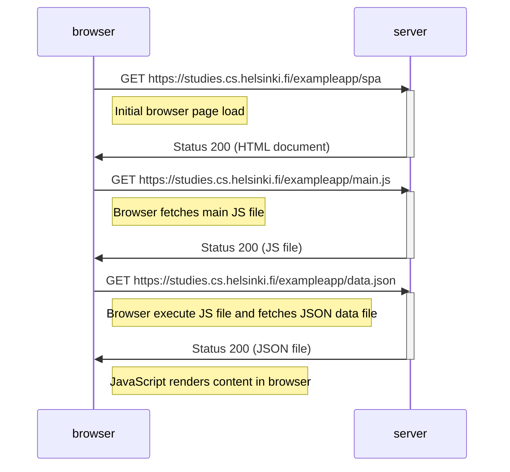

# Loading Page (SPA)

```mermaid
    sequenceDiagram
        participant browser
        participant server

        browser->>server: GET https://studies.cs.helsinki.fi/exampleapp/spa
        activate server
        Note right of browser: Initial browser page load

        server->>browser: Status 200 (HTML document)
        deactivate server

        browser->>server: GET https://studies.cs.helsinki.fi/exampleapp/main.js
        activate server
        Note right of browser: Browser fetches main JS file
        server->>browser: Status 200 (JS file)
        deactivate server

        browser->>server: GET https://studies.cs.helsinki.fi/exampleapp/data.json
        activate server
        Note right of browser: Browser execute JS file and fetches JSON data file
        server->>browser: Status 200 (JSON file)
        deactivate server

        Note right of browser: JavaScript renders content in browser
```