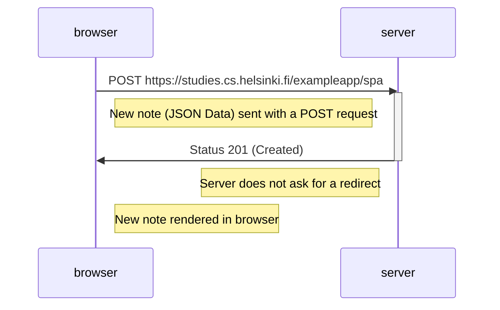

# Create New Note (SPA)

```mermaid
    sequenceDiagram
        participant browser
        participant server

        browser->>server: POST https://studies.cs.helsinki.fi/exampleapp/spa
        activate server
        Note right of browser: New note (JSON Data) sent with a POST request

        server->>browser: Status 201 (Created)
        deactivate server
        Note left of server: Server does not ask for a redirect

        Note right of browser: New note rendered in browser
```