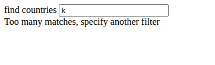

# Countries

Small React app to search countries and view details (including capital weather).

## Features

- Search/filter countries by name (case-insensitive).
- Show short list of matched countries; when only one match, show full details.
- Click "show" to toggle details for a country from the list.
- Display country flag (emoji) with adjustable size via CSS.
- Fetch weather for the country's capital (requires OpenWeatherMap API key).

## Quick start

1. Install dependencies
```bash
git clone <Repository>
cd part/countries
npm install
```

2. Set OpenWeatherMap API key (if weather is used)
Create a `.env` file in the project root:
```bash
# .env
REACT_APP_WEATHER_API_KEY=your_openweathermap_api_key_here
```

3. Run in development
```bash
npm start
```

## Project structure (important files)

- src/App.jsx — main app, manages countries, filter and selection
- src/components/Filter.jsx — filter input component
- src/components/Countries.jsx — list / detail rendering logic
- src/components/Country.jsx — single country row (with "show" button)
- src/components/CountryDetails.jsx — full country details + weather
- src/services/countries.js — fetch countries (REST Countries API)
- src/services/weather.js — fetch weather (OpenWeatherMap)

## Screenshots

<figure>
    
    <figcaption>Too many matches</figcaption>
</figure>

<figure>
    
    <figcaption>Matching list</figcaption>
</figure>

<figure>
    
    <figcaption>Single match</figcaption>
</figure>

<figure>
    
    <figcaption>Selected country</figcaption>
</figure>

## APIs used

- [REST Countries](https://studies.cs.helsinki.fi/restcountries/) (for country data)
- [OpenWeatherMap](https://openweathermap.org/) (for capital weather)

## License

- MIT
